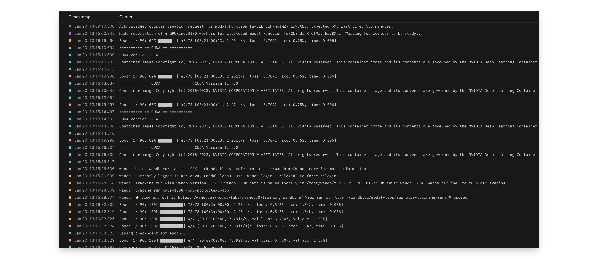

# Training Resnet50 on ImageNet using Multi-node clusters

This example demonstrates Modal's multi-node training functionality by training a Resnet50 model on the ImageNet dataset.

By using 4 x 8 H100 SXM GPUs we can complete 90 epoch of training in 40 minutes and reach a validation accuracy of 71%.
Training for more epochs should increase validation score to at least 80%.



## Step 1: Downloading Data

To download the ImageNet dataset into a `modal.Volume` use `modal run imagenet_download.py::run_download`.
After downloading has completed you should have contents in the `/data/` directory of your Volume like this:

```
              Directory listing of '/data' in 'imagenet'
┏━━━━━━━━━━━━━━━━━━━━━━━━━━━━┳━━━━━━┳━━━━━━━━━━━━━━━━━━━━━━┳━━━━━━━━━━┓
┃ Filename                   ┃ Type ┃ Created/Modified     ┃ Size     ┃
┡━━━━━━━━━━━━━━━━━━━━━━━━━━━━╇━━━━━━╇━━━━━━━━━━━━━━━━━━━━━━╇━━━━━━━━━━┩
│ data/train_images_4.tar.gz │ file │ 2024-10-18 22:39 UTC │ 27.1 GiB │
│ data/train_images_1.tar.gz │ file │ 2024-10-18 22:30 UTC │ 27.3 GiB │
│ data/train_images_3.tar.gz │ file │ 2024-10-18 22:30 UTC │ 27.2 GiB │
│ data/train_images_2.tar.gz │ file │ 2024-10-18 22:30 UTC │ 27.0 GiB │
│ data/train_images_0.tar.gz │ file │ 2024-10-18 22:30 UTC │ 27.1 GiB │
│ data/test_images.tar.gz    │ file │ 2024-10-18 22:29 UTC │ 12.6 GiB │
│ data/val_images.tar.gz     │ file │ 2024-10-18 22:29 UTC │ 6.2 GiB  │
└────────────────────────────┴──────┴──────────────────────┴──────────┘
```

To download other datasets you can experiment with `convert_to_webdataset.ipynb` locally.

## Step 2: Training

1. Modify `training/config.py` as needed.
2. Run `modal run --detach modal_train.py`.

During training you can observe using Modal's dashboard, the Weights & Biases dashboard, or
the `modal container list` and `modal container exec` commands to get a terminal on a running cluster container.

````
$ modal container exec ta-01JJ2QBWNT9885DYZRPK05D95B bash
root@modal:~# nvidia-smi
Mon Jan 20 20:45:36 2025
+-----------------------------------------------------------------------------------------+
| NVIDIA-SMI 550.90.07              Driver Version: 550.90.07      CUDA Version: 12.4     |
|-----------------------------------------+------------------------+----------------------+
| GPU  Name                 Persistence-M | Bus-Id          Disp.A | Volatile Uncorr. ECC |
| Fan  Temp   Perf          Pwr:Usage/Cap |           Memory-Usage | GPU-Util  Compute M. |
|                                         |                        |               MIG M. |
|=========================================+========================+======================|
|   0  NVIDIA H100 80GB HBM3          On  |   00000000:04:00.0 Off |                    0 |
| N/A   43C    P0            486W /  700W |   55664MiB /  81559MiB |    100%      Default |
|                                         |                        |             Disabled |
+-----------------------------------------+------------------------+----------------------+
|   1  NVIDIA H100 80GB HBM3          On  |   00000000:05:00.0 Off |                    0 |
| N/A   41C    P0            464W /  700W |   55648MiB /  81559MiB |    100%      Default |
|                                         |                        |             Disabled |
...
...
```
