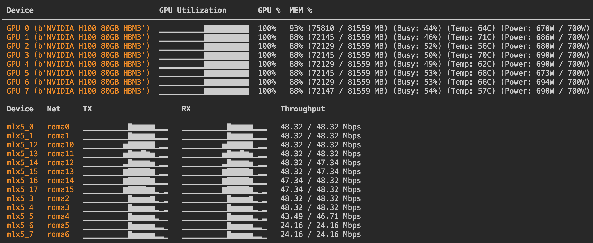

# Utils

This directory contains utility scripts.

- `mlx_monitor.py`: A script to monitor the network and GPU usage of a machine.

## mlx_monitor.py

Add this to your image as such:

```python
image = base_image.add_local_file("../utils/mlx_monitor.py", remote_path="/root/mlx_monitor.py")
```

Then shell into your container and run the script:

```bash
$ modal shell ta-01JWC5ZQZSAGXK2YMC8VSZGCG0
$> uv run mlx_monitor.py
```

This should give you a nice table of the network and GPU usage of the machine:


